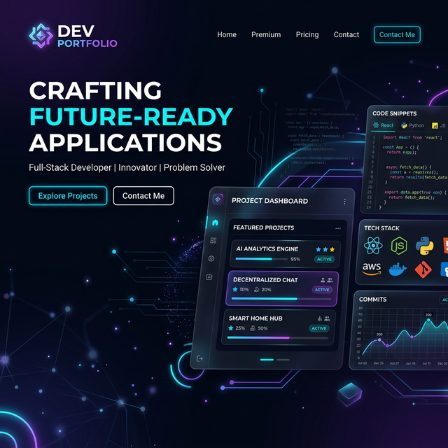
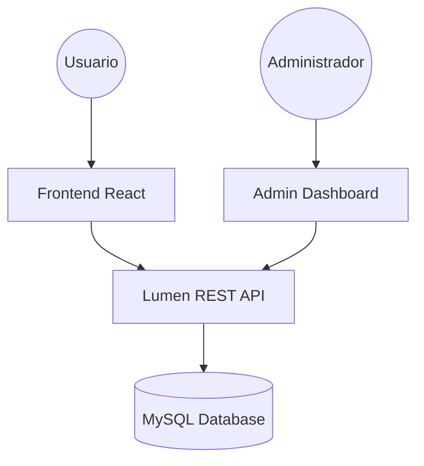

# 🚀 Fullstack Dev Portfolio & Admin CMS



> **Una solución integral para desarrolladores:** Un portafolio moderno y dinámico acoplado a un potente sistema de gestión de contenidos (CMS) para administrar tu presencia profesional sin tocar una línea de código.

---

## ✨ Características Principales

| Característica                 | Descripción                                                                                            |
| :----------------------------- | :----------------------------------------------------------------------------------------------------- |
| **🖥️ Dashboard Admin**         | Gestión completa de proyectos, habilidades, experiencia laboral, testimonios, perfil y redes sociales. |
| **⚡ API RESTful**             | Backend construido con Laravel Lumen con autenticación JWT y operaciones CRUD completas.               |
| **🐳 Arquitectura Docker**     | Entorno de producción unificado mediante contenedor Docker con Nginx para el frontend.                 |
| **🔷 React & TypeScript**      | Componentes reutilizables con shadcn/ui, hooks personalizados y TanStack Query.                        |

---

## 🛠 Tech Stack

| Componente        | Tecnología               | Uso Principal                |
| :---------------- | :----------------------- | :--------------------------- |
| **Frontend**      | React 18 / Vite          | Core Framework               |
| **Styling**       | Tailwind CSS / shadcn/ui | Sistema de Diseño e Interfaz |
| **Backend**       | PHP 8.1 / Lumen 9        | RESTful API & Business Logic |
| **Base de Datos** | MySQL                    | Almacenamiento Persistente   |
| **Herramientas**  | Docker / NPM / Composer  | DevOps & Package Management  |

---

## 🏗 Arquitectura del Sistema



---

## 📂 Estructura del Proyecto (Frontend)

- `src/components/` - Componentes de UI (Hero, Projects, Skills, Experience, etc.).
- `src/components/ui/` - Componentes base de shadcn/ui.
- `src/components/admin/` - Componentes compartidos del panel admin.
- `src/pages/` - Vistas principales (Index, NotFound, AdminLogin).
- `src/pages/admin/` - CRUD managers: Dashboard, Profile, Projects, Skills, Experience, Testimonials, Social.
- `src/services/` - Capa de comunicación con la API (Axios + servicios por recurso).
- `src/hooks/` - Lógica reutilizable (auth, skills, configs, section counter, etc.).
- `src/layouts/` - Estructuras de página compartidas (AdminLayout).
- `src/config/` - Configuración de entorno (env).

---

## 🚀 Instalación y Configuración

### 🐳 Opción 1: Docker (Recomendado)

```bash
docker compose up -d --build
```

> El contenedor sirve el frontend en `http://localhost:3000`. Asegúrate de tener el backend corriendo en `http://localhost:8080`.

### 🛠 Opción 2: Manual

#### Backend (Lumen)

1. Clona y navega a `portafolio-dev-backend/`
2. Instala dependencias: `composer install`
3. Configura el `.env`: `cp .env.example .env`
4. Inicia el servidor: `php -S localhost:8080 -t public`

#### Frontend (React)

1. Navega a `portafolio-dev-frontend/`
2. Instala dependencias: `npm install`
3. Configura el `.env`: Define `VITE_API_URL=http://localhost:8080/api/v1`
4. Inicia el servidor: `npm run dev`

---

## 📡 Endpoints de la API (v1)

> Todas las rutas están bajo el prefijo `/api/v1`

### Autenticación
- `POST /auth/login` - Inicia sesión y obtiene token JWT.
- `GET /auth/me` - Obtiene datos del usuario autenticado.

### Configuración
- `GET /configs/get` - Obtiene la configuración global del sitio.
- `POST /configs/update` - Actualiza la configuración del perfil.

### Proyectos Destacados
- `GET /featured-projects` - Lista todos los proyectos.
- `POST /featured-projects` - Crea un nuevo proyecto.
- `PUT /featured-projects/:id` - Actualiza un proyecto.
- `DELETE /featured-projects/:id` - Elimina un proyecto.

### Habilidades
- `GET /skills` - Lista todas las habilidades.
- `POST /skills` - Crea una habilidad.
- `PUT /skills/:id` - Actualiza una habilidad.
- `DELETE /skills/:id` - Elimina una habilidad.

### Categorías de Habilidades
- `GET /skills-category` - Lista todas las categorías.
- `GET /skills-category/get-skills` - Habilidades agrupadas por categoría.
- `POST /skills-category` - Crea una categoría.
- `PUT /skills-category/:id` - Actualiza una categoría.
- `DELETE /skills-category/:id` - Elimina una categoría.

### Experiencia Laboral
- `GET /work-experiences` - Lista todas las experiencias.
- `POST /work-experiences` - Crea una experiencia.
- `PUT /work-experiences/:id` - Actualiza una experiencia.
- `DELETE /work-experiences/:id` - Elimina una experiencia.

### Testimonios
- `GET /testimonials` - Lista todos los testimonios.
- `POST /testimonials` - Crea un testimonio.
- `PUT /testimonials/:id` - Actualiza un testimonio.
- `DELETE /testimonials/:id` - Elimina un testimonio.

### Redes Sociales
- `GET /social-networks/get` - Obtiene los enlaces a redes sociales.
- `POST /social-networks` - Crea una red social.
- `PUT /social-networks/:id` - Actualiza una red social.
- `DELETE /social-networks/:id` - Elimina una red social.

---

## 🤝 Contribución

¡Las contribuciones son bienvenidas!

1. Haz un **Fork** del proyecto.
2. Crea una **rama** para tu feature: `git checkout -b feature/NuevaMejora`
3. Realiza tus **commits**: `git commit -m 'Añade una mejora increíble'`
4. Sube la rama: `git push origin feature/NuevaMejora`
5. Abre un **Pull Request**.

---

## 📄 Licencia

Este proyecto está bajo la Licencia **MIT**. Consulta el archivo `LICENSE` para más detalles.

---

<p align="center">
  Hecho con ❤️ por <b>CortesLuis03</b>
</p>
