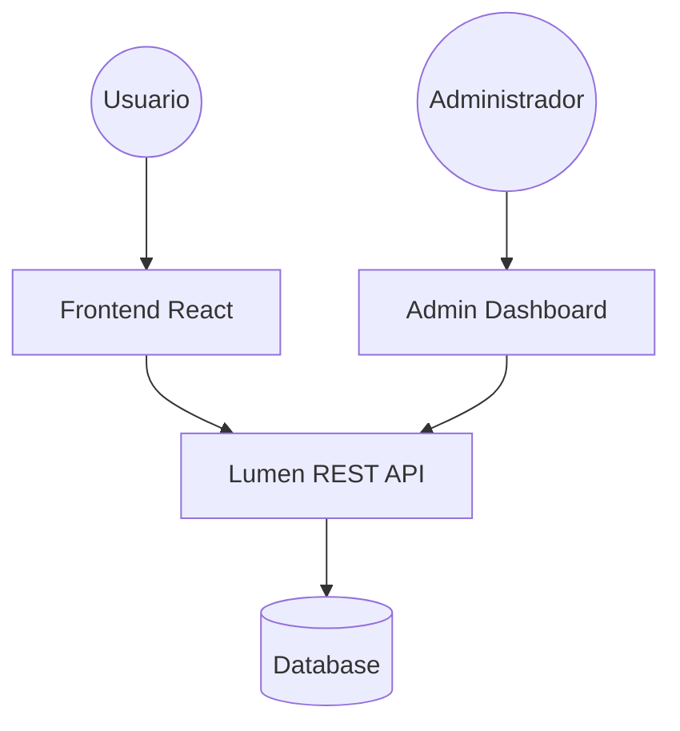

# 🚀 Fullstack Dev Portfolio & Admin CMS


> **Una solución integral para desarrolladores:** Un portafolio moderno y dinámico acoplado a un potente sistema de gestión de contenidos (CMS) para administrar tu presencia profesional sin tocar una línea de código.

---

## ✨ Características Principales

| Característica                 | Descripción                                                                                            |
| :----------------------------- | :----------------------------------------------------------------------------------------------------- |
| **🖥️ Dashboard Admin**         | Gestión completa de proyectos, habilidades, experiencia y testimonios mediante una interfaz intuitiva. |
| **⚡ API de Alto Rendimiento** | Backend construido con Laravel Lumen, optimizado para una entrega de datos ultrarrápida.               |
| **🐳 Arquitectura Docker**     | Entorno persistente y unificado mediante contenedores Docker para un despliegue sin fricciones.        |
| **🔷 React & TypeScript**      | Código tipado y escalable con hooks personalizados y gestión de estado con TanStack Query.             |

---

## 🛠 Tech Stack

| Componente        | Tecnología               | Uso Principal                |
| :---------------- | :----------------------- | :--------------------------- |
| **Frontend**      | React 18 / Vite          | Core Framework               |
| **Styling**       | Tailwind CSS / shadcn/ui | Sistema de Diseño e Interfaz |
| **Backend**       | PHP 8.1 / Lumen 9        | RESTful API & Business Logic |
| **Base de Datos** | MySQL / PostgreSQL       | Almacenamiento Persistente   |
| **Herramientas**  | Docker / NPM / Composer  | DevOps & Package Management  |

---

## 🏗 Arquitectura del Sistema



---

## 📂 Estructura del Proyecto (Frontend)

- `src/components/` - Componentes atómicos y de UI (shadcn/ui).
- `src/pages/` - Vistas principales y panel de administración.
- `src/services/` - Capa de comunicación con la API (Axios).
- `src/layouts/` - Estructuras de página compartidas.
- `src/hooks/` - Lógica de negocio reutilizable.

---

## 🚀 Instalación y Configuración

### 🐳 Opción 1: Docker (Recomendado)

Si tienes Docker instalado, puedes levantar ambos servicios con un solo comando:

```bash
docker-compose up -d --build
```

### 🛠 Opción 2: Manual

#### 1. Backend (Lumen)

1. Navega a `portafolio-dev-backend/`
2. Instala dependencias: `composer install`
3. Configura el `.env`: `cp .env.example .env`
4. Inicia el servidor: `php -S localhost:8000 -t public`

#### 2. Frontend (React)

1. Navega a `portafolio-dev-frontend/`
2. Instala dependencias: `npm install`
3. Configura el `.env`: Define `VITE_API_URL=http://localhost:8000/api/v1`
4. Inicia el servidor: `npm run dev`

---

## 📡 Endpoints de la API (v1)

> Todas las rutas están bajo el prefijo `/api/v1`

- `GET /configs` - Obtiene la configuración global del sitio.
- `GET /skills` - Lista todas las habilidades técnicas.
- `GET /social-networks` - Obtiene los enlaces a redes sociales.
- `GET /skills-category/get-skills` - Obtiene habilidades agrupadas por categoría.

---

## 🤝 Contribución

¡Las contribuciones son bienvenidas!

1. Haz un **Fork** del proyecto.
2. Crea una **rama** para tu feature: `git checkout -b feature/NuevaMejora`
3. Realiza tus **commits**: `git commit -m 'Añade una mejora increíble'`
4. Sube la rama: `git push origin feature/NuevaMejora`
5. Abre un **Pull Request**.

---

## 📄 Licencia

Este proyecto está bajo la Licencia **MIT**. Consulta el archivo `LICENSE` para más detalles.

---

<p align="center">
  Hecho con ❤️ por <b>CortesLuis03</b>
</p>
