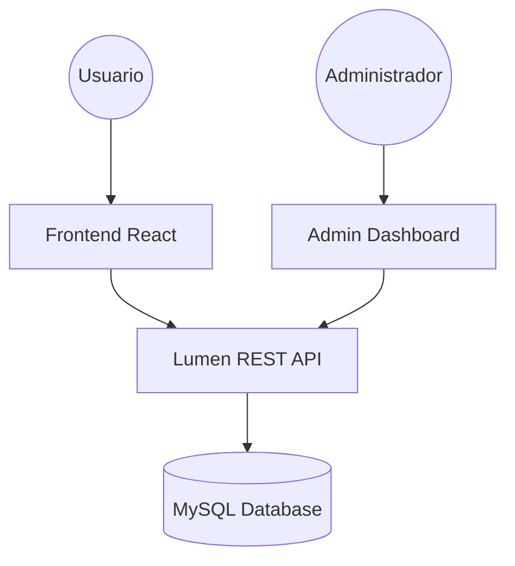

import { Terminal, Code, Cpu, Globe, Layout, Database } from "lucide-react";

# 🚀 Fullstack Dev Portfolio & Admin CMS


> **Una solución integral para desarrolladores:** Un portafolio moderno y dinámico acoplado a un potente sistema de gestión de contenidos (CMS) para administrar tu presencia profesional sin tocar una línea de código.

---

## ✨ Características Principales

<div className="grid grid-cols-1 md:grid-cols-2 gap-4 my-8">
  <div className="p-4 border rounded-xl bg-card">
    <div className="flex items-center gap-2 mb-2">
      <Layout className="w-5 h-5 text-blue-500" />
      <h3 className="font-bold">Dashboard Administrativo</h3>
    </div>
    <p className="text-sm opacity-80">
      Gestión completa de proyectos, habilidades, experiencia y testimonios
      mediante una interfaz intuitiva con shadcn/ui.
    </p>
  </div>
  <div className="p-4 border rounded-xl bg-card">
    <div className="flex items-center gap-2 mb-2">
      <Cpu className="w-5 h-5 text-purple-500" />
      <h3 className="font-bold">API de Alto Rendimiento</h3>
    </div>
    <p className="text-sm opacity-80">
      Backend construido con Laravel Lumen, optimizado para entregar datos en
      milisegundos.
    </p>
  </div>
  <div className="p-4 border rounded-xl bg-card">
    <div className="flex items-center gap-2 mb-2">
      <Globe className="w-5 h-5 text-green-500" />
      <h3 className="font-bold">Arquitectura Dockerizada</h3>
    </div>
    <p className="text-sm opacity-80">
      Entorno de desarrollo y producción unificado mediante contenedores Docker
      para un despliegue sin fricciones.
    </p>
  </div>
  <div className="p-4 border rounded-xl bg-card">
    <div className="flex items-center gap-2 mb-2">
      <Code className="w-5 h-5 text-orange-500" />
      <h3 className="font-bold">React & TypeScript</h3>
    </div>
    <p className="text-sm opacity-80">
      Código tipado y escalable con hooks personalizados y gestión de estado
      mediante TanStack Query.
    </p>
  </div>
</div>

---

## 🛠 Tech Stack

| Componente        | Tecnología               | Uso Principal                |
| :---------------- | :----------------------- | :--------------------------- |
| **Frontend**      | React 18 / Vite          | Core Framework               |
| **Styling**       | Tailwind CSS / shadcn/ui | Sistema de Diseño e Interfaz |
| **Backend**       | PHP 8.1 / Lumen 9        | RESTful API & Business Logic |
| **Base de Datos** | MySQL                    | Almacenamiento Persistente   |
| **Tools**         | Docker / Composer / NPM  | DevOps & Package Management  |

---

## 🏗 Arquitectura del Sistema



---

## 📂 Estructura del Proyecto

<details>
<summary>📂 <b>Frontend (portafolio-dev-frontend)</b></summary>

- `src/components/` - Componentes atómicos y de UI (shadcn/ui).
- `src/pages/` - Vistas principales y panel de administración.
- `src/services/` - Capa de comunicación con la API (Axios).
- `src/layouts/` - Estructuras de página compartidas.
- `src/hooks/` - Lógica de negocio reutilizable.
  </details>

<details>
<summary>📂 <b>Backend (portafolio-dev-backend)</b></summary>

- `app/Http/Controllers/` - Lógica de control de endpoints.
- `app/Models/` - Modelos de Eloquent para la base de datos.
- `routes/web.php` - Definición de rutas y prefijos de API.
- `database/migrations/` - Esquema de la base de datos.
  </details>

---

## 🚀 Instalación y Configuración

### 🐳 Opción 1: Docker (Recomendado)

Si tienes Docker instalado, puedes levantar ambos servicios con un solo comando:

```bash
docker-compose up -d --build
```

### 🛠 Opción 2: Manual

#### Backend (Lumen)

1. Navega a `portafolio-dev-backend/`
2. Instala dependencias: `composer install`
3. Configura el `.env`: `cp .env.example .env`
4. Inicia el servidor: `php -S localhost:8000 -t public`

#### Frontend (React)

1. Navega a `portafolio-dev-frontend/`
2. Instala dependencias: `npm install`
3. Configura el `.env`: Define `VITE_API_URL=http://localhost:8000/api/v1`
4. Inicia el servidor: `npm run dev`

---

## 📡 Endpoints de la API (v1)

> Todas las rutas están bajo el prefijo `/api/v1`

- `GET /configs` - Obtiene la configuración global del sitio.
- `GET /skills` - Lista todas las habilidades técnicas.
- `GET /social-networks` - Obtiene los enlaces a redes sociales.
- `GET /skills-category/get-skills` - Obtiene habilidades agrupadas por categoría.

---

## 🤝 Contribución

¡Las contribuciones son bienvenidas! Por favor, abre un Issue para discutir cambios antes de enviar un Pull Request.

1. Haz un Fork del proyecto.
2. Crea una rama para tu feature: `git checkout -b feature/AmazingFeature`
3. Haz commit de tus cambios: `git commit -m 'Add some AmazingFeature'`
4. Sube la rama: `git push origin feature/AmazingFeature`
5. Abre un PR.

---

## 📄 Licencia

Este proyecto está bajo la Licencia **MIT**. Consulta el archivo `LICENSE` para más detalles.

---

<p align="center">
  Hecho con ❤️ por <b>CortesLuis03</b>
</p>
